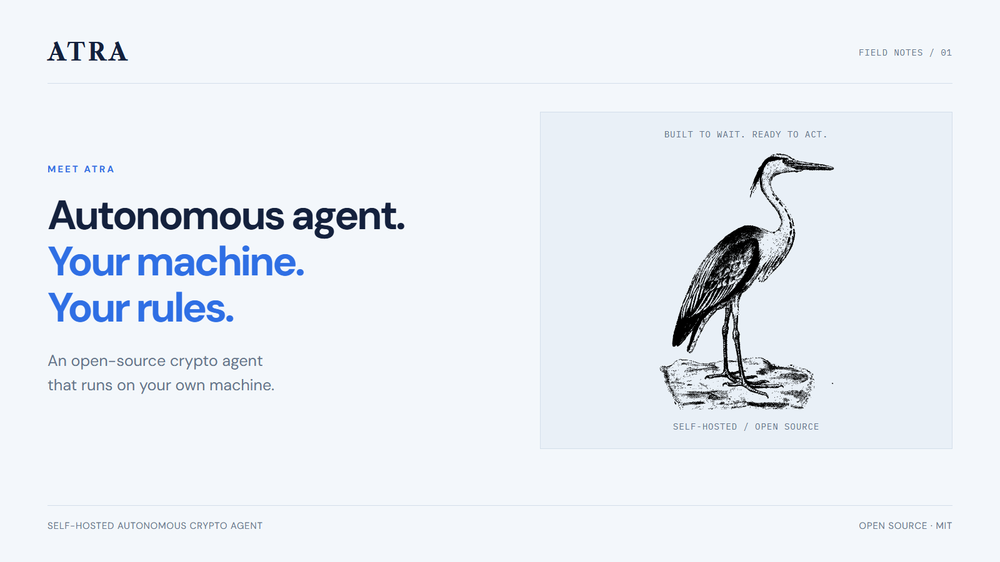
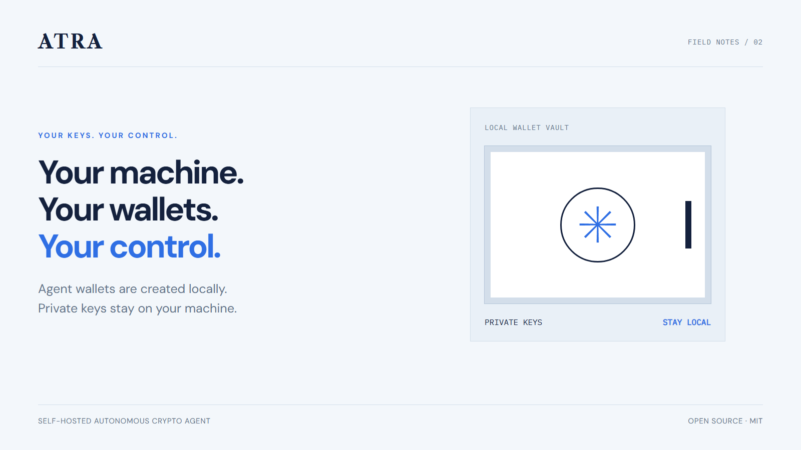
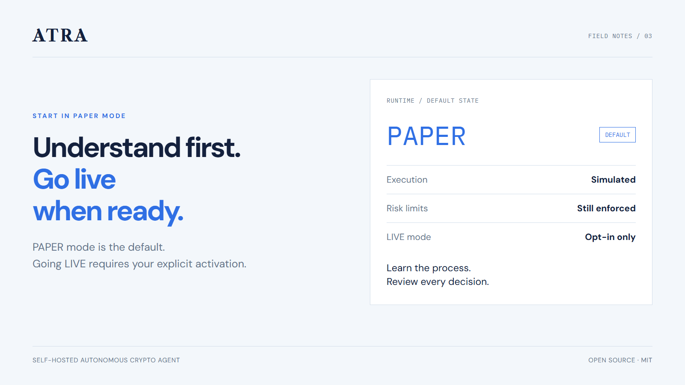
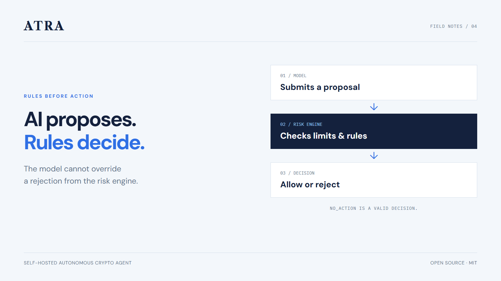
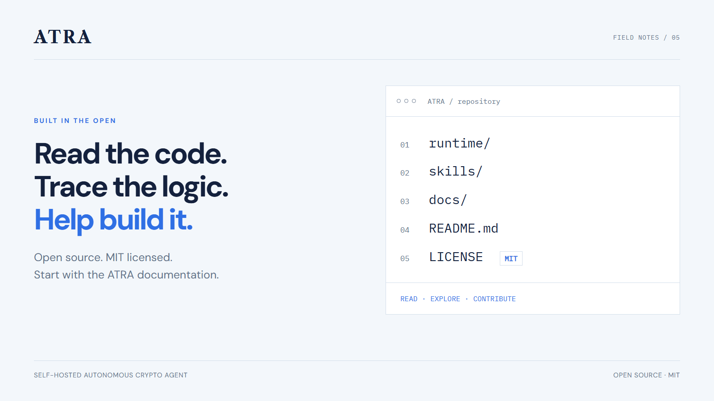

# 5 X posts — ATRA

English. Suggested order: 01-05. Attach one image per post and copy the corresponding caption.

## 1. MEET ATRA



```text
Meet ATRA: an open-source crypto agent that runs on your machine. Local agent wallets, market research, and risk limits you set. Start in PAPER mode. Understand the process. Stay in control. #ATRA #OpenSource
```

## 2. YOUR KEYS. YOUR CONTROL.



```text
Your machine. Your wallets. Your control. ATRA creates agent wallets locally and encrypts them at rest. Private keys stay on your computer. You decide the capital and the limits. #ATRA #SelfHosted
```

## 3. START IN PAPER MODE



```text
ATRA starts in PAPER mode: simulated trading, with risk rules still enforced. LIVE mode requires explicit activation and resets to PAPER on every restart. Learn the process before enabling real trades. #ATRA #BuildInPublic
```

## 4. RULES BEFORE ACTION



```text
The model proposes. The risk engine decides. ATRA checks limits and rules before execution. The model cannot sign transactions or override a rejection. Sometimes the right decision is NO_ACTION. #ATRA #OpenSource
```

## 5. BUILT IN THE OPEN



```text
Read the code. Trace the logic. Help build it. ATRA is open source under the MIT license. Explore the runtime, agent rules, and docs. Found a bug or have an idea? Start a contribution. #ATRA #OpenSource #BuildInPublic
```

